# AI Music Generator Web App

A Django web application that allows users to generate, manage, and share AI-created music tracks using third-party music generation APIs (Suno / Mureka).

Prepared by **Chachalit Khanarat** — Hong Software Co.
Based on SRS v1.0 (29/01/2026)

---

## Quick Start

```bash
# 1. Create & activate a virtual environment
python -m venv venv
source venv/bin/activate     # Linux/Mac
venv\Scripts\activate        # Windows

# 2. Install dependencies
pip install -r requirements.txt

# 3. Copy environment config and fill in your values
cp .env.example .env

# 4. Apply database migrations
python manage.py migrate

# 5. Create a superuser (for Django Admin & local login)
python manage.py createsuperuser

# 6. Start the development server  (Terminal 1)
python manage.py runserver

# 7. Start the background task worker  (Terminal 2 — REQUIRED for music generation)
python manage.py qcluster
```

> **Both terminals must be running.** Without `qcluster`, submitted generation requests will queue in the database but never execute.

Visit `http://127.0.0.1:8000/` — you will be redirected to the login page.

---

## Environment Variables

Copy `.env.example` to `.env` and fill in your values:

| Variable | Description |
|----------|-------------|
| `SECRET_KEY` | Django secret key |
| `GOOGLE_CLIENT_ID` | Google OAuth client ID (see `.env.example` for setup steps) |
| `GOOGLE_CLIENT_SECRET` | Google OAuth client secret |
| `MUSIC_API_PROVIDER` | Default provider: `mureka` or `suno` |
| `MUREKA_API_KEY` | API key from platform.mureka.ai |
| `SUNO_API_KEY` | API key from sunoapi.org |
| `SUNO_BASE_URL` | Suno base URL (default: `https://api.sunoapi.org`) |

---

## Google OAuth Setup (one-time)

1. Go to [Google Cloud Console](https://console.cloud.google.com/) → APIs & Services → Credentials
2. Create an **OAuth 2.0 Client ID** (Web application)
3. Add authorised redirect URI: `http://localhost:8000/accounts/google/login/callback/`
4. Copy the Client ID and Secret into `.env`
5. In Django Admin → **Sites** → change domain to `localhost:8000`
6. In Django Admin → **Social Applications** → add a new Google provider using those credentials

---

## Features

| Feature | SRS Ref | Status |
|---------|---------|--------|
| Walled Garden (login required everywhere) | REQ-4.1.1 | ✅ |
| Username / password login | REQ-4.1.2 | ✅ |
| Google OAuth login | REQ-4.1.2 | ✅ |
| Token deduction per generation | REQ-4.2.1 | ✅ |
| Block generation when tokens = 0 | REQ-4.2.2 | ✅ |
| Admin token management (Django Admin) | REQ-4.2.3 | ✅ |
| 6-field music generation form | REQ-4.3.1 | ✅ |
| Async generation (non-blocking browser) | REQ-4.3.2 | ✅ |
| Navigate away while generating | REQ-4.3.3 | ✅ |
| Global status bar with real-time progress | REQ-4.3.4 | ✅ |
| Token refund on failure / timeout | REQ-4.3.7 | ✅ |
| Personal library with track list | REQ-4.4.1 | ✅ |
| Delete track (with confirmation modal) | REQ-4.4.2 | ✅ |
| Tracks private by default | REQ-4.4.3 | ✅ |
| Toggle public / private + share URL | REQ-4.4.4 | ✅ |
| Public Listen Page (no login required) | REQ-4.4.5 | ✅ |
| Persistent mini-player (Play, Pause, Seek, Volume) | REQ-4.5.1 | ✅ |
| Player continues across page navigation | REQ-4.5.2 | ✅ |
| Profanity / bad-word filter on inputs | REQ-5.2.1 | ✅ |
| API keys stored in environment variables | REQ-5.3.2 | ✅ |
| Dark / Light mode toggle | SRS 3.1.2 | ✅ |
| Responsive layout (320 px → desktop) | SRS 5.6.3 | ✅ |
| Toast notifications | UC-02 | ✅ |
| Empty library state with CTA | UC-02 A3 | ✅ |
| Generation / Failed status badges | UC-01 | ✅ |

---

## Exercise 4 — Strategy Pattern (Mock vs Suno API)

### Strategy Interface

Defined in `music/services/base.py`:

```python
class MusicGenerationStrategy(ABC):
    @property
    @abstractmethod
    def name(self) -> str: ...

    @abstractmethod
    def generate(self, song) -> str:
        """Submit parameters, poll until complete, return audio URL."""
```

### Available Strategies

| Key | Class | File | Description |
|-----|-------|------|-------------|
| `mock` | `MockSongGeneratorStrategy` | `music/services/mock.py` | Offline, deterministic — returns a fixed audio URL after a 2 s delay. No API key needed. |
| `suno` | `SunoStrategy` | `music/services/suno.py` | Calls `api.sunoapi.org` — POST to generate, polls `record-info` until `SUCCESS`. |
| `mureka` | `MurekaStrategy` | `music/services/mureka.py` | Calls `api.mureka.ai` — POST to generate, polls `song/query/{id}` until `complete`. |

Strategy selection is **centralized** in `music/services/__init__.py → get_strategy()`.

### Running in Mock Mode (offline, no API key)

Set `GENERATOR_STRATEGY=mock` in your `.env`:

```
GENERATOR_STRATEGY=mock
```

Then start normally:

```bash
python manage.py runserver   # Terminal 1
python manage.py qcluster    # Terminal 2
```

Submit any generation form — the background worker will return a fixed sample MP3 in ~2 seconds. No API key is required.

### Running in Suno Mode

Set `GENERATOR_STRATEGY=suno` (or leave it empty and pick "Suno" in the form):

```
GENERATOR_STRATEGY=suno
SUNO_API_KEY=your-suno-api-key-here
SUNO_BASE_URL=https://api.sunoapi.org
```

The Suno strategy:
1. POSTs to `/api/v1/generate` with `Authorization: Bearer <token>`
2. Extracts the returned `taskId`
3. Polls `GET /api/v1/generate/record-info?taskId=...` every 5 seconds
4. Returns the `streamAudioUrl` once status is `SUCCESS` or `FIRST_SUCCESS`

### Where to put the Suno API key

**Never commit your key.** Store it only in `.env` (which is git-ignored):

```
SUNO_API_KEY=sk-...your-key-here...
```

Get your key from [sunoapi.org](https://sunoapi.org).

### Strategy Selection Logic

`GENERATOR_STRATEGY` in `.env` overrides the per-request provider globally:

```
GENERATOR_STRATEGY=mock    # All generation uses Mock (offline)
GENERATOR_STRATEGY=suno    # All generation uses Suno regardless of form
GENERATOR_STRATEGY=        # (empty) User's form choice is used
```

---


```
ai_music_generator/          # Django project config
  settings.py                # All settings (allauth, django-q2, API keys)
  urls.py                    # Root router → allauth + music app

music/
  models/                    # Domain entities (1 file per model)
    user.py                  # User (Creator / Admin role)
    profile.py               # Profile (token_balance)
    token_record.py          # Token audit trail
    library.py               # Library (1-to-1 with User)
    folder.py                # Folder inside a Library
    song.py                  # Song (core entity, all metadata + timestamps)
  controllers/               # Use-case business logic
    generate_music.py        # UC-01: request, complete, fail, refund
    manage_library.py        # UC-02: list, delete, toggle privacy
    admin_token.py           # UC-03: set balance, list users
  services/                  # Strategy pattern for AI providers
    base.py                  # Abstract MusicGenerationStrategy (ABC)
    mock.py                  # Mock strategy (offline, deterministic)
    mureka.py                # Mureka API implementation
    suno.py                  # Suno API implementation
    utils.py                 # Shared poll_until() utility
    __init__.py              # Provider registry + get_strategy()
  signals.py                 # post_save signal: auto-create Profile + Library on User creation
  tasks.py                   # django-q2 background task (async generation)
  profanity.py               # Bad-word filter (REQ-5.2.1)
  views.py                   # Django view functions
  urls.py                    # App URL patterns
  admin.py                   # Django Admin config for all models
  templates/music/
    base.html                # Shared layout: nav, status bar, mini-player,
                             #   theme toggle, toasts, modal, responsive CSS
    generate.html            # UC-01 generation form
    library.html             # UC-02 track list with play/delete/privacy actions
    public_listen.html       # Public share page (no auth required)
  migrations/                # 4 migration files (0001–0004)
  management/commands/
    seed_and_demo.py         # Demo seed data for all 3 use cases

templates/
  registration/login.html    # Login page with username + Google OAuth button
```

---

## Class Diagram

The diagram is organized by the **MVT + Controller + Strategy** architecture layers.

```mermaid
classDiagram
    %% ── MODEL LAYER ─────────────────────────────────────────────────────────
    class User {
        +String name
        +String email
        +String role
    }
    class Profile {
        +int token_balance
        +can_afford(cost) bool
        +deduct(cost) void
        +refund(cost) void
    }
    class TokenRecord {
        +int amount
        +String type
    }
    class Library {
    }
    class Folder {
        +String name
    }
    class Song {
        +String title
        +String genre
        +String mood
        +String occasion
        +String singer_style
        +String topic
        +int duration
        +String status
        +String provider
        +String file_url
        +bool is_public
        +UUID share_token
        +mark_complete(url) void
        +mark_failed() void
        +toggle_privacy() void
    }
    class GenerationLog {
        +String title
        +String genre
        +String mood
        +String status
    }

    %% ── CONTROLLER LAYER ────────────────────────────────────────────────────
    class GenerateMusicController {
        +request_generation(user, ...) Song
        +mark_complete(song_id, url) Song
        +mark_failed(song_id) Song
    }
    class ManageLibraryController {
        +get_library(user) List
        +delete_song(user, song_id) void
        +toggle_privacy(user, song_id) Song
    }
    class AdminTokenController {
        +list_users() List
        +set_balance(user_id, amount) void
    }

    %% ── SERVICE LAYER — Strategy Pattern ────────────────────────────────────
    class MusicGenerationStrategy {
        <<abstract>>
        +name() str
        +generate(song) str
    }
    class MockSongGeneratorStrategy {
        +name() str
        +generate(song) str
    }
    class SunoStrategy {
        +name() str
        +generate(song) str
    }
    class MurekaStrategy {
        +name() str
        +generate(song) str
    }

    %% ── TEMPLATE LAYER ──────────────────────────────────────────────────────
    class base_html["base.html (Template)"] {
        nav, status-bar, mini-player, theme-toggle
    }
    class generate_html["generate.html (Template)"] {
        6-field generation form
    }
    class library_html["library.html (Template)"] {
        track list, play/delete/privacy actions
    }
    class public_listen_html["public_listen.html (Template)"] {
        public share page (no auth)
    }

    %% ── VIEW LAYER ──────────────────────────────────────────────────────────
    class views_py["views.py (View)"] {
        +generate_view()
        +library_view()
        +public_listen_view()
        +generation_status_api()
        +download_track_view()
    }

    %% ── RELATIONSHIPS ───────────────────────────────────────────────────────
    User "1" --o "1" Profile : has
    User "1" --o "1" Library : has
    User "1" --o "*" Song : owns
    User "1" --o "*" TokenRecord : records
    Library "1" --o "*" Folder : contains
    Folder "1" --o "*" Song : groups
    Song "1" --o "*" GenerationLog : logged_in

    GenerateMusicController --> Profile : deduct / refund
    GenerateMusicController --> Song : create / update status
    GenerateMusicController --> GenerationLog : create
    ManageLibraryController --> Song : read / delete / toggle
    AdminTokenController --> Profile : read / set balance
    AdminTokenController --> TokenRecord : create

    MusicGenerationStrategy <|-- MockSongGeneratorStrategy : implements
    MusicGenerationStrategy <|-- SunoStrategy : implements
    MusicGenerationStrategy <|-- MurekaStrategy : implements

    views_py --> GenerateMusicController : delegates UC-01
    views_py --> ManageLibraryController : delegates UC-02
    views_py --> AdminTokenController : delegates UC-03
    views_py ..> base_html : renders
    views_py ..> generate_html : renders
    views_py ..> library_html : renders
    views_py ..> public_listen_html : renders
```



---

## Domain Model

| Entity | Key Fields |
|--------|-----------|
| **User** | name, email, role (Creator/Admin) |
| **Profile** | token_balance (integer, 0–9999) |
| **TokenRecord** | amount, type (Earned/Spent) |
| **Library** | one-to-one with User |
| **Folder** | name, FK → Library |
| **Song** | title, genre, mood, occasion, singer_style, topic, duration, status, provider, file_url, is_public, share_token, created_at, updated_at |

Song statuses: `Draft → Generating → Completed / Failed`

---

## Use Cases

### UC-01 — Generate and Share Music
1. User fills in the generation form (title required; genre, mood, occasion, singer style, topic optional)
2. System checks token balance and runs profanity filter
3. Tokens deducted; background task queued via django-q2
4. User is redirected to Library immediately (non-blocking)
5. Global status bar polls `/api/generation-status/` every 3 seconds and updates in real time
6. On completion the track appears in the Library; on failure tokens are refunded
7. User can toggle a track Public to get a shareable link; anyone can open it without logging in

### UC-02 — Manage Library & Playback
1. Library lists all tracks with status badges, genre, mood, duration, privacy
2. Click **Play** on a completed track → mini-player appears in the footer
3. Navigate to another page → audio keeps playing (state saved in localStorage)
4. Click **Delete** → confirmation modal; on confirm, track is removed and a toast appears
5. Click **Make Public / Private** → privacy toggled instantly
6. Empty library shows a friendly message with a link to the generator

### UC-03 — Admin Token Management
- Django Admin at `/admin/` → User Profiles → edit `token_balance`
- Every change is recorded in `django_admin_log` automatically
- Balance is validated: 0 ≤ balance ≤ 9999

---

## Running Tests

```bash
python manage.py test
```

The test suite covers the Strategy Pattern (20 tests):
- Strategy interface (ABC, inheritance, registry)
- Mock strategy (deterministic output, no network)
- Suno strategy (task submission, polling, failure handling)
- Strategy selection (env-var override, case-insensitive lookup)

All 20 tests pass.

---

## Seed Data (Demo)

```bash
python manage.py seed_and_demo
```

Creates sample users, profiles, libraries, and songs and prints a walkthrough of all three use cases.

---

## Dependencies

| Package | Purpose |
|---------|---------|
| `django>=5.0` | Web framework |
| `python-dotenv` | Load `.env` into settings |
| `requests` | HTTP calls to Suno / Mureka APIs |
| `django-allauth` | Google OAuth + account management |
| `django-q2` | Background task queue (async generation) |
| `PyJWT` | JWT verification for allauth Google provider |
| `cryptography` | Cryptographic backend for PyJWT |
