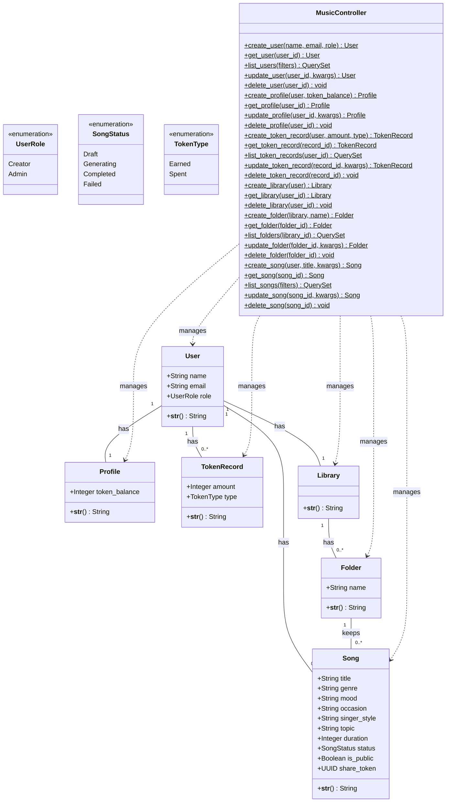
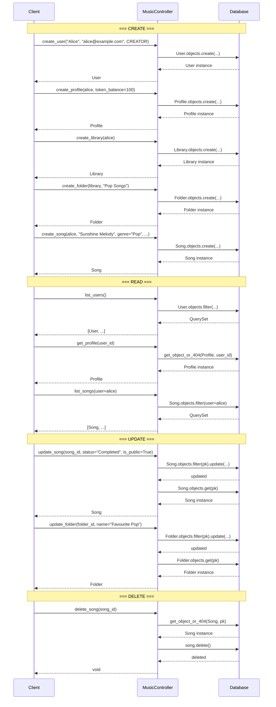

# AI Music Generator – Domain Layer (Exercise 3)

Django implementation of the AI Music Generator domain model.

## Domain Entities

| Entity | Description |
|---|---|
| **User** | A platform user with a role (Creator / Admin) |
| **Profile** | One-to-one with User; holds `token_balance` |
| **TokenRecord** | Many-per-user record of token transactions (Earned / Spent) |
| **Library** | One-to-one with User; organises songs into folders |
| **Folder** | Named folder inside a Library; holds songs |
| **Song** | Core entity with title, genre, mood, occasion, singer style, topic, duration, status (Draft / Generating / Completed / Failed), visibility flag, and share token |

## Setup

```bash
# 1. Create & activate a virtual environment (recommended)
python -m venv venv
source venv/bin/activate   # Linux/Mac
venv\Scripts\activate      # Windows

# 2. Install dependencies
pip install -r requirements.txt

# 3. Apply migrations
python manage.py migrate

# 4. Create a superuser for Django Admin
python manage.py createsuperuser

# 5. Run the development server
python manage.py runserver
```

## CRUD Operations

### Via Django Admin

Visit `http://127.0.0.1:8000/admin/` and log in with your superuser credentials.
All domain entities (User, Profile, TokenRecord, Library, Folder, Song) are registered and fully manageable through the admin interface.

### Via Management Command

Run the included demo command to seed sample data and see Create, Read, Update, and Delete operations in action:

```bash
python manage.py seed_and_demo
```

Output demonstrates:
- **Create** – Users, Profiles, TokenRecords, Libraries, Folders, Songs
- **Read** – Querying users, filtering songs by user, retrieving token balances
- **Update** – Changing song status, adjusting token balance, renaming folders
- **Delete** – Removing a song and verifying the count

### Via MusicController

All CRUD operations are handled by a single unified controller (`music/controllers.py`):

```python
from music.controllers import MusicController

# Create
user = MusicController.create_user(name='Alice', email='alice@example.com')
profile = MusicController.create_profile(user=user, token_balance=100)
library = MusicController.create_library(user=user)
folder = MusicController.create_folder(library=library, name='My Songs')
song = MusicController.create_song(user=user, title='My Song', genre='Pop')

# Read
user = MusicController.get_user(user_id=1)
songs = MusicController.list_songs(user=user)

# Update
MusicController.update_song(song_id=1, status='Completed', is_public=True)

# Delete
MusicController.delete_song(song_id=1)
```

## Project Structure

```
ai_music_generator/          # Django project settings
music/
  models/                    # Domain models (1 model per file)
    __init__.py              # Re-exports all models
    user.py                  # User model
    profile.py               # Profile model
    token_record.py          # TokenRecord model
    library.py               # Library model
    folder.py                # Folder model
    song.py                  # Song model
  controllers.py             # Unified MusicController with CRUD for all models
  admin.py                   # Django Admin registration for CRUD
  management/commands/
    seed_and_demo.py         # Management command demonstrating CRUD operations
  migrations/                # Database migration files
```

## Class Diagram



## Sequence Diagram (CRUD Operations)


